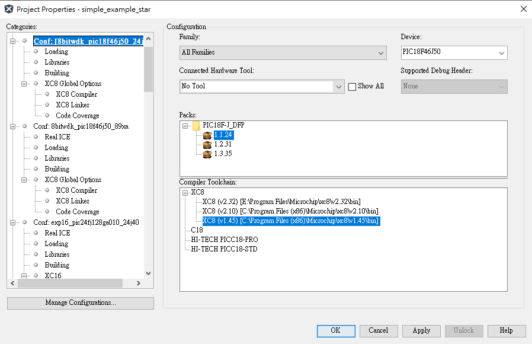
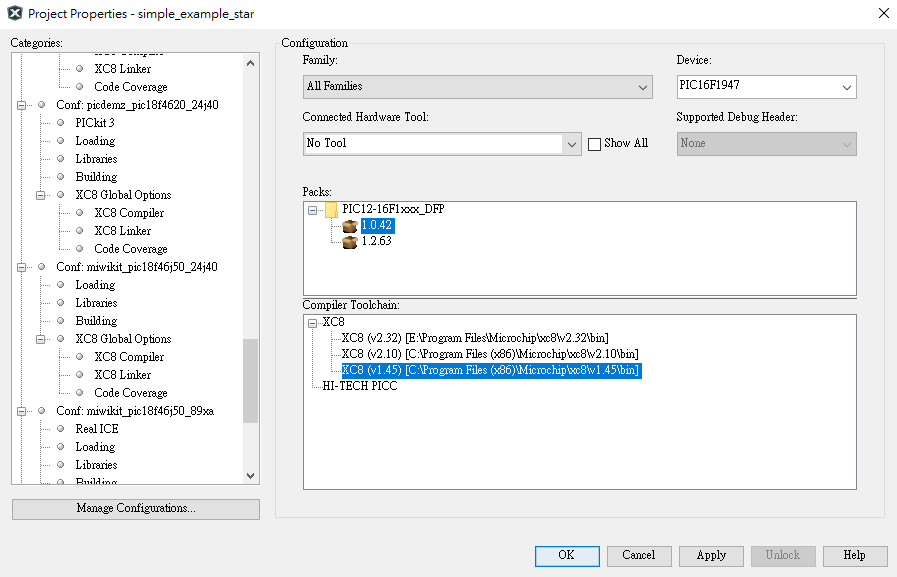
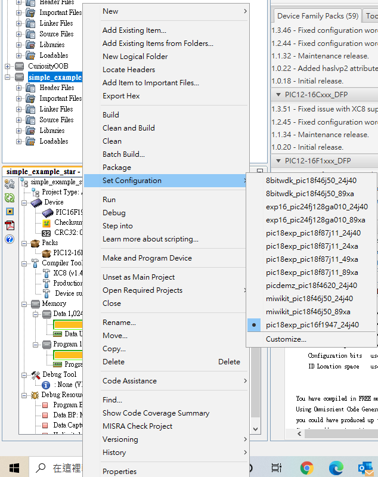
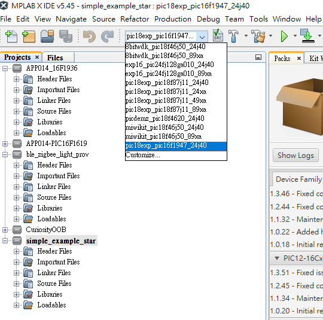

# MRF-MiWi

### "Wireless Made Easy!" - Microchip MiWi P2P and Star Stack Opened for MRF24J40 and MRF89XA transceiver running on MPLAB X IDE

Devices: | MRF24J40 | MRF89XA   Supported Host MCU: | PIC18F46J50 | PIC18F4620 | PIC18F87J11 | PIC24FJ128GA010 | PIC16F1947

## ⚠ Important considerations

<b>THE SOFTWARE ARE PROVIDED "AS IS" AND GIVE A PATH FOR SELF-SUPPORT AND SELF-MAINTENANCE.

This repository contains unsupported example code intended to help accelerate client product development. It is not validated for production nor audited for security best-practices. This software was designed and released without modern security practices in mind and has known potential security vulnerabilities. Users of this codebase are advised to use this in non-security-critical applications, and are responsible for ensuring that it is used appropriately. Note that while this repository is unsupported, Microchip welcome community contributions, and all pull-requests will be considered for inclusion into the repository.

</b>

## ⚠ *This is what you Must know about MRF MiWi!!!*

<b>MRF-MiWi is not compatible with [MiWi protocol](https://www.microchip.com/en-us/products/wireless-connectivity/sub-ghz/miwi-protocol) supporting SAMR21 and SAMR30 SoC devices.

  MRF MiWi supports only MRF24J40 and MRF89XA tranceiver IC based devices. MRF MiWi supports PIC16F1947, PIC18F46J50, PIC18F4620, PIC18F87J11 and PIC24FJ128GA010 as host MCUs.
</b>

## *Security Vulnerability Fixes are provided for MRF MiWi*

<b>Security Vulnerability Fixes are provided for MRF MiWi in [miwi_p2p.c](VulnerabilityFix/miwi_p2p.c). The file with fixes can be found in `..\MRF-MiWi\VulnerabilityFix` folder  in cloned MRF-MiWi directory. You can replace original miwi_p2p.c in `..\MRF-MiWi\MRF_MiWi_v5_0_0\framework\miwi\src\` folder with the new miwi_p2p.c file to invoke the fixes.

## Resources

- [Microchip MPLAB X IED IDE](https://www.microchip.com/en-us/development-tools-tools-and-software/mplab-x-ide)
- [8-Bit Wireless Development Kit User's guide](resources/media/8-Bit%20Wireless%20Development%20Kit%20User's%20guide.pdf)
- [MRF24J40MA module device page](https://www.microchip.com/en-us/product/MRF24J40MA)
- [MRF24J40 Related materials](resources/media/MRF24J40)
- [MRF89XAM8A module device page](https://www.microchip.com/en-us/product/MRF89XAM8A)
- [MRF89XAM9A module device page](https://www.microchip.com/en-us/product/MRF89XAM9A)
- [MRF89XA Related materials](resources/media/MRF89XA)
- [MPLAB® Development Ecosystem Downloads Archive](https://www.microchip.com/en-us/development-tools-tools-and-software/mplab-ecosystem-downloads-archive) This is for XC8 compiler v.1.45 download required for MRF MiWi PIC18 device branch code build

## A la carte

1. [Overview](#step1)
1. [Hardware Platforms](#step2)
1. [Software Requirements](#step3)
1. [Software Environment Setup](#step4)
   1. [Must Read to resolve XC8 compiler build issues](#step4a)
   1. [Location of 3 sample projects in MRF MiWi package](#step4b)
   1. [Select a Build configuration](#step4c)
1. [Sample Applications](#step5)
   1. [Chat Demo](#step5a)
   1. [Simple Example P2P](#step5b)
   1. [Simple Example Star](#step5c)

## Introduction

### Protocol Overview
The MiWi P2P protocol stack modifies the IEEE 802.15.4 specification MAC layer by adding commands that simplify the handshaking process. It simplifies link disconnection and channel hopping by providing supplementary MAC commands. However, application-specific decisions, such as when to perform an energy scan or when to jump channels, are not defined in the protocol. The implementation is left to the application developers to do in application layer.
### Protocol Features
The MiWi P2P Wireless Protocol has the following features:
* Supports Microchip PICand and PIC24 platforms through Microchip XC8, and XC16 compilers, respectively
* Supports MRF24J40 (IEEE 802.15.4 compliant radio transceiver) and MRF89XA (proprietary radio transceiver) through Microchip Application Libraries
* Functions as a state machine (not RTOS-dependent)
* Supports a sleeping device at the end as a communication node
* Enables Energy Detect (ED) scanning to operate on the least-noisy channel
* Provides active scan for detecting new and existing connections
* Supports frequency agility (channel hopping)
### Protocol Considerations
The MiWi P2P protocol is a variation of IEEE 802.15.4 and supports both peer-to-peer (P2P) and star topologies. It has no routing mechanism, hence the wireless communication coverage is defined by the radio range. The Guaranteed Time Slot (GTS) and Beacon networks by option are not supported, hence both the sides of the communication cannot simultaneously go to Sleep mode. If the application requires wireless networking and routing instead of P2P and Star type communication, MiWi Mesh is a suitable communication platform for proprietary standards. For interoperability type of requirements with wireless devices or nodes of other vendors, ZigBee® protocol based on IEEE802.15.4 will a good option.

## Hardware Platforms

| Supported MCU families | Supported Transceivers | Supported boards |
| --- | --- | --- |
| <b>PIC18F87J11</b> |MRF24J40 | PICDEM™ PIC18 Explorer Demonstration Board |
|  | MRF89XA | PICDEM™ PIC18 Explorer Demonstration Board |
| <b>PIC24FJ128GA010</b> | MRF24J40 | Explorer 16 Development Board |
|  | MRF89XA | Explorer 16 Development Board |
| <b>PIC18F46J50</b> | MRF24J40 | 8-Bit Wireless Development Kit |
|  | MRF89XA | 8-Bit Wireless Development Kit |
|  | MRF24J40 | MiWi™ Demo Kit |
|  | MRF89XA | MiWi™ Demo Kit |
| <b>PIC18F4620</b> |MRF24J40 | PICDEM™ Z Demonstration Kit |
| <b>PIC16F1947</b> |MRF24J40 | PICDEM™ PIC18 Explorer Demonstration Board |

## Software Requirements

* [Microchip MPLAB X IED IDE](https://www.microchip.com/en-us/development-tools-tools-and-software/mplab-x-ide)
* [MPLAB® XC Compilers](https://www.microchip.com/en-us/development-tools-tools-and-software/mplab-xc-compilers) Install latest XC16 compliler
* [MPLAB® Development Ecosystem Downloads Archive](https://www.microchip.com/en-us/development-tools-tools-and-software/mplab-ecosystem-downloads-archive) This is for XC8 compiler v.1.45 download required for MRF MiWi PIC18 device branch code build

* MRF MiWi package ([Clone/Download](https://docs.github.com/en/free-pro-team@latest/github/creating-cloning-and-archiving-repositories/cloning-a-repository) the current repo to get the software)

Notes: The MRF MiWi protocol package is validated with MPLAB X IDE v5.45.

## Software Environment Setup

...

### Must Read to resolve XC8 compiler build issues

PIC16 and PIC18 project configurations in MRF MiWi package are not compatible with latest Microchip XC8 v2.xx compilers. You must install XC8 v1.45 from [MPLAB® Development Ecosystem Downloads Archive](https://www.microchip.com/en-us/development-tools-tools-and-software/mplab-ecosystem-downloads-archive) to build PIC16 and PIC18 configurations in MRF MiWi package.

The latest DFPs are not compatible with XC8 v1.45 compiler. Earlier DFPs will need to be installed from Tools => Packs in MPLAB X IDE. The specific device pack can then be selected together with compiler version option in Project Properties. 

Below 2 pictures show 8-Bit Wireless Development Kit PIC18F46J50 Project Properties and PICDEM™ PIC18 Explorer Demonstration Board PIC16F1947 Project Properties.

 

Before a PIC16 or PIC18 configuration in MRF MiWi package is built, a good combination of compiler and DFP must be set so the project can be built successfully.

### Location of 3 sample projects in MRF MiWi package

You can find 3 sample projects in `..\MRF-MiWi\MRF_MiWi_v5_0_0\apps\miwi\miwi_p2p`.

### Select a Build Configuration

AFter the sample project is opened in MPLAB X IDE, you can select a build configuration in MPLAB X IDE by right-clicking on the sample project and select "set configuration".

Alternatively, the configuration can also be set by a pull down menu on MPLAB X IDE tool bar below file menu.

## Sample Applications

### Chat Demo

#### Overview

- This is a wireless UART application based upon MRF MiWi P2P. Two nodes are used in this application.

- Supports 8-Bit Wireless Development Kit with PIC18F46J50 as host MCU

- To test this application, open a terminal for both the nodes. On entering text in the terminal, the data is transmitted from one Node to another node.

- A PC UART COM port terminal (19200 8 N 1) need to be connected to each of the 2 nodes.

### Simple Example P2P

#### Overview

This project demonstrates MRF MiWi P2P functions on various MCU EVBs.

- 8-Bit Wireless Development Kit with PIC18F46J50 as host MCU
- PICDEM™ PIC18 Explorer Demonstration Board with PIC16F1947 and PIC18F87J11 as host MCU
- Explorer 16 Development Board with PIC24FJ128GA010 as host MCU
- MiWi™ Demo Kit with PIC18F46J50 as host MCU
- PICDEM™ Z Demonstration Kit with PIC18F4620 as host MCU

### Simple Example Star

#### Overview

This project demonstrates MRF MiWi Star functions on various MCU EVBs.

- 8-Bit Wireless Development Kit with PIC18F46J50 as host MCU
- PICDEM™ PIC18 Explorer Demonstration Board with PIC16F1947 and PIC18F87J11 as host MCU
- Explorer 16 Development Board with PIC24FJ128GA010 as host MCU
- MiWi™ Demo Kit with PIC18F46J50 as host MCU
- PICDEM™ Z Demonstration Kit with PIC18F4620 as host MCU
